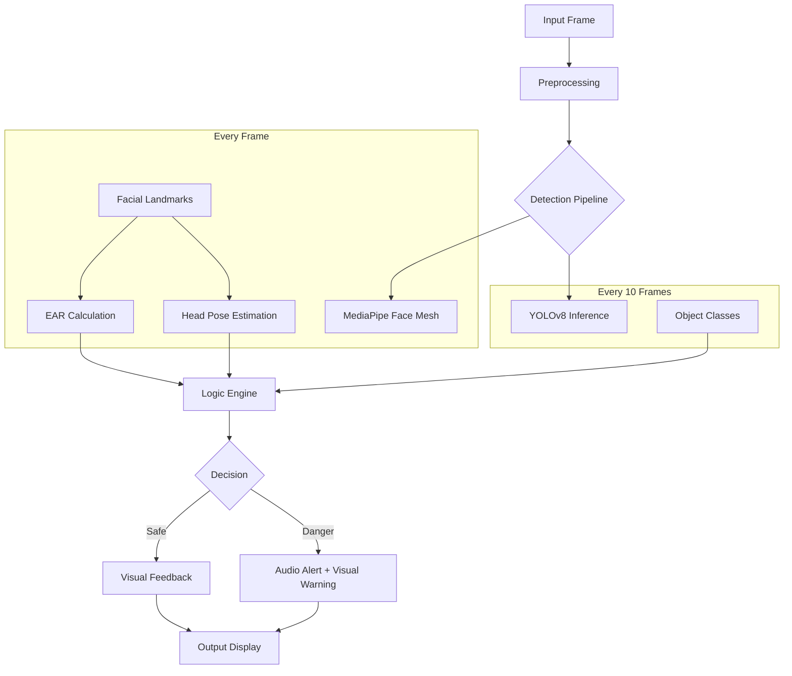

# Behavior Detector

[](https://www.python.org/)
[](https://github.com/ultralytics/ultralytics)
[](https://developers.google.com/mediapipe)
[](https://opencv.org/)

> **A real-time, multi-modal AI system designed to monitor driver and user behavior for safety and focus.**

The **Behavior Detector** is an advanced computer vision application that combines facial landmark analysis with deep learning-based object detection to identify dangerous or distracted behaviors in real-time. It seamlessly integrates **Drowsiness Detection**, **Head Pose Estimation**, and **Object Recognition** (Phone, Food, Drink) into a unified monitoring pipeline.

---

## 🎥 Demo

See the system in action:

[]([LINKEDIN_DEMO_LINK])

*(Please ensure you replace `[https://www.linkedin.com/posts/mohsinnyz_just-completed-aprojectof-my-cv-portfolio-activity-7424426778892382209-5mta?utm_source=share&utm_medium=member_desktop&rcm=ACoAAD-hOpsBy8Ui1sLYmLInXe6vzIfnXcIi3QM]` with the actual URL).*

---

## 🚀 Key Features

### 1. 😴 Drowsiness Detection
Uses **MediaPipe Face Mesh** to track eye openness in real-time.
- **Metric**: **Eye Aspect Ratio (EAR)**.
- **Logic**: Calculates the ratio of vertical to horizontal eye landmarks. If the EAR falls below a calibrated threshold (`0.25`) for a set duration (`0.5s`), an alarm is triggered.
- **Precision**: 468-point face mesh ensures accuracy even with partial occlusion.

### 2. 🤯 Distraction Detection (Head Pose)
Estimates the user's attention focus by analyzing head orientation.
- **Algorithm**: **Perspective-n-Point (PnP)**.
- **Logic**: Maps 2D facial landmarks (Nose, Chin, Eyes, Mouth) to a generic 3D face model to compute **Pitch (Up/Down)** and **Yaw (Left/Right)** angles.
- **Alert**: Triggers if the user looks away from the road/screen for more than `10` consecutive frames.

### 3. 📷 Object Detection (YOLOv8)
Deploys a fine-tuned **YOLOv8 Nano** model to recognize specific high-risk objects.
- **Classes**:
  - `📱 Phone` (Texting/Calling)
  - `🍔 Food` (Eating)
  - `🥤 Drink` (Drinking)
- **Performance**: Optimized to run every `N` frames (configurable) to maintain high system FPS while ensuring timely detection of actions.

### 4. 🔊 Smart Alerts
- **Audio Feedback**: Threaded audio engine plays distinct alarm sounds for "Danger" (Drowsy/Phone) vs. "Warning" (Distracted) without freezing the video feed.
- **Visuals**: Color-coded bounding boxes and on-screen status indicators.

---

## 🏗️ System Architecture

The system operates on a dual-pipeline architecture to balance speed and accuracy.



---

## 📦 Installation

### Prerequisites
- Python 3.10 or higher.
- Webcam (Built-in or USB).

### Step-by-Step

1.  **Clone the Repository**
    ```bash
    git clone https://github.com/yourusername/BehaviorDetector.git
    cd BehaviorDetector
    ```

2.  **Create Virtual Environment**
    ```bash
    python -m venv venv
    source venv/bin/activate  # Windows: venv\Scripts\activate
    ```

3.  **Install Dependencies**
    ```bash
    pip install -r requirements.txt
    ```

4.  **Model Layout**
    Ensure the trained model weights are present:
    - Place your `best.pt` file in `models/best.pt`.

---

## 🚦 Usage

Start the monitoring system:

```bash
python -m src.main
```

### Controls
| Key | Action |
| :--- | :--- |
| **`q`** | Quit the Application |

---

## ⚙️ Configuration

Tune the system performance in `src/config.py`.

| Parameter | Default | Description |
| :--- | :--- | :--- |
| `CAMERA_INDEX` | `0` | Camera ID (0 for default webcam). |
| `CONFIDENCE_THRESHOLD` | `0.30` | Minimum confidence for YOLO object detection. |
| `DETECTION_INTERVAL` | `10` | Run YOLO every N frames (lower = more accurate, higher = faster). |
| `EAR_THRESHOLD` | `0.25` | Eye Aspect Ratio below this counts as "Closed". |
| `PITCH_THRESHOLD` | `25` | Max head tilt (up/down) before "Distracted". |
| `YAW_THRESHOLD` | `30` | Max head turn (left/right) before "Distracted". |
| `ENABLE_AUDIO` | `True` | Toggle sound alerts on/off. |

---

## 🧠 Training & Fine-Tuning

The model was trained using the **Ultralytics YOLOv8** framework.

### Dataset Structure
The system expects data in standard YOLO format:
```
data/
├── train/
│   ├── images/
│   └── labels/
└── valid/
    ├── images/
    └── labels/
```

### Training
You can reproduce the training process using the provided notebook:
`notebooks/BehaviorDetector_FineTuning.ipynb`

Or run via CLI:
```bash
yolo detect train data=data/data.yaml model=yolov8n.pt epochs=50 imgsz=640
```

---

## 📂 Project Structure

```text
BehaviorDetector/
├── data/                 # Raw and processed datasets
├── models/               # Trained model weights (best.pt)
├── notebooks/            # Jupyter notebooks for experimentation
├── src/
│   ├── detectors/        # Core logic modules
│   │   ├── drowsiness.py # EAR logic
│   │   ├── distraction.py# PnP Head Pose logic
│   │   ├── object_det.py # YOLOv8 wrapper
│   │   └── face_mesh.py  # MediaPipe wrapper
│   ├── utils/
│   │   ├── alerts.py     # Threaded audio player
│   │   └── visualizer.py # Drawing utilities
│   ├── config.py         # Global settings
│   └── main.py           # Application entry point
├── collect_data.py       # Utility to capture training images
├── requirements.txt      # Python dependencies
└── README.md             # Project documentation
```

---

## 🤝 Contributing

Contributions are welcome! Please perform the following steps:
1.  Fork the project.
2.  Create your feature branch (`git checkout -b feature/AmazingFeature`).
3.  Commit your changes (`git commit -m 'Add some AmazingFeature'`).
4.  Push to the branch (`git push origin feature/AmazingFeature`).
5.  Open a Pull Request.

---

## 📜 License

Distributed under the MIT License. See `LICENSE` for more information.
